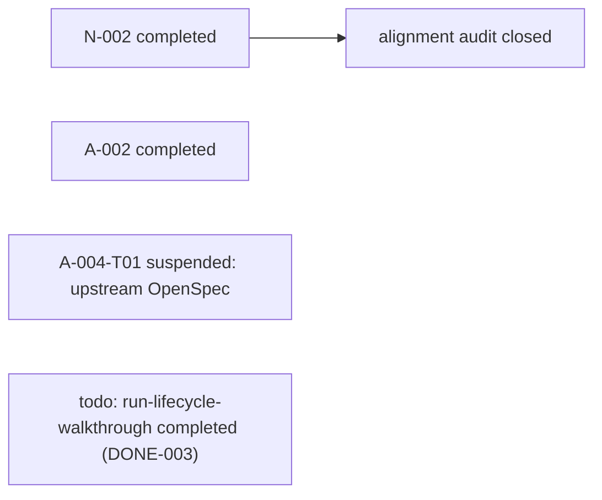

# Active Todos — 活跃 todo + 依赖链 + 执行顺序

> 最后更新: 2026-09-27 深夜（DONE-010 controller-evaluation-repetition 完成：controller failed ×3、topic-planning pass ×3；活跃区清零） | `_backlog/todos/` — 活跃 todo 在此，做完移入 [`../_done/_done_todos/`](../_done/_done_todos/)。
>
> **本文件是所有活跃工作的中枢。** todo 没有编号，文件名即标识（`todo-<name>.md`）。完成后文件名不变，位置即状态。

## 完成一个 todo 的步骤

1. `git mv todos/todo-<name>.md _done/_done_todos/todo-<name>.md`
2. 更新 `_done/_done_todos/README.md`（加一行 + 更新 Next available DONE ID）
3. 更新本文件（删掉该 todo）
4. 更新 `../_done/README.md`（DONE 计数 +1）

**todo 和 bug 不同——todo 没有编号，只有 slug 名。命名权威是文件名本身。**

---

## 活跃列表

| # | 文件 | 优先级 | 简述 | 阻塞 / 备注 |
|---|------|--------|------|-------------|
| （无活跃 todo——最后一张 DONE-010 于 2026-09-27 深夜关闭） | | | | |

---

## 已暂停的延期跟进

| 项 | 暂停原因 | 重启条件 |
| --- | --- | --- |
| A-004-T01 scenario-rename validator | 当前行为由外部 `@fission-ai/openspec@1.8.0` 共同的 validate/archive scenario-presence guard 拥有；本仓没有安全局部修改。 | 用户单独授权对 Fission-AI/OpenSpec 的 issue/proposal/PR，或授权调查一个明确支持 scenario identity/rename 的版本升级。 |
| A-009 risk-based semantic traceability | 长期候选未排期（2026-08-13 起），触发条件自创建起从未满足，无任何可执行 action。 | 出现高风险 requirement change 且审查明确需要 scenario 级语义 traceability 时重新设计。 |

完整卡片和研究证据在
[`../_done/_suspended_plans/todo-a004t01-openspec-scenario-rename-validator.md`](../_done/_suspended_plans/todo-a004t01-openspec-scenario-rename-validator.md)
及其 [owner research](../_done/_closed_plans/alignment-audit-2026-08-12/alignment-audit-60-adjustments/a004t01-scenario-rename-owner-research/a004t01-scenario-rename-owner-research.md)。

---

## 依赖链

> N-002 与 A-002 已完成；A-004-T01 与 A-009 已暂停（后者长期无触发条件）；
> run-lifecycle-walkthrough 已完成（DONE-003）。



---

## 推荐执行顺序

> 依赖链不等于优先级。这里给出**当前该按什么顺序做**，并一句话说明"为什么这个比那个更堵"。

| 顺序 | 项 | 为什么 |
|------|-----|--------|
| （无待排期项） | | |

---

## 卡片模板

新建 todo 文件 `todo-<name>.md`（`<name>` 用 kebab-case slug，即标识）：

```markdown
# TODO: <name>

> 状态: 待设计 / 设计中 / 实施中 | 优先级: 高 / 中 / 低 | 更新: 2026-MM-DD
> 上游: <前置 todo/bug/plan> | 下游: <后续>

## Why
为什么要做——问题、痛点、现在做的理由。

## 现状对齐
把"旧期望 vs 现状"对齐，避免重做已落地的部分。

## Current Direction
当前打算怎么做（可含候选字段/接口草案）。

## Design Questions
悬而未决、需要先想清的关键设计问题。

## Non-Goals
明确不做什么，防止范围膨胀。

## Next Step
下一个具体动作（常是 `/opsx:explore <topic>` 起一个 OpenSpec change）。
```
