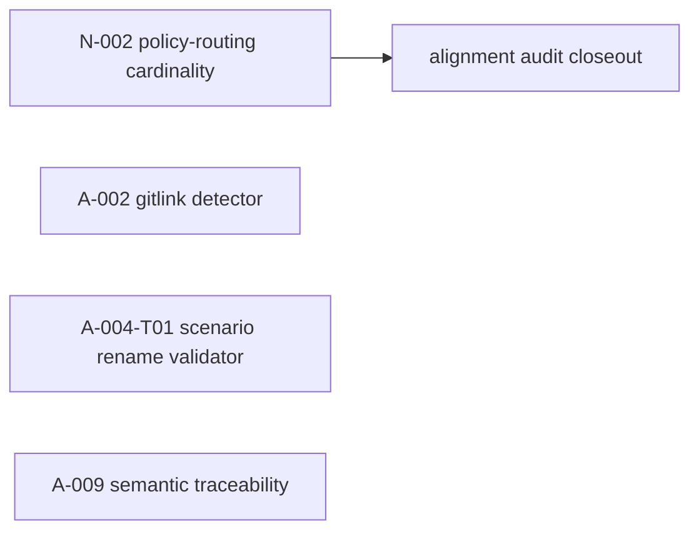

# Active Todos — 活跃 todo + 依赖链 + 执行顺序

> 最后更新: 2026-08-13 | `_backlog/todos/` — 活跃 todo 在此，做完移入 [`../_done/_done_todos/`](../_done/_done_todos/)。
>
> **本文件是所有活跃工作的中枢。** todo 没有编号，文件名即标识（`todo-<name>.md`）。完成后文件名不变，位置即状态。

## 完成一个 todo 的步骤

1. `git mv todos/todo-<name>.md _done/_done_todos/todo-<name>.md`
2. 更新 `_done/_done_todos/README.md`（加一行 + 更新 Next available DONE ID）
3. 更新本文件（删掉该 todo）
4. 更新 `../_done/README.md`（DONE 计数 +1）

**todo 和 bug 不同——todo 没有编号，只有 slug 名。命名权威是文件名本身。**

---

## 活跃列表

| # | 文件 | 优先级 | 简述 | 阻塞 / 备注 |
|---|------|--------|------|-------------|
| 1 | [todo-a002-gitlink-boundary-detector.md](todo-a002-gitlink-boundary-detector.md) | 高 | 为 `deerflow/` gitlink 建立自动边界检测 | 需要独立治理 change；不得读取/修改 DeerFlow 源码 |
| 2 | [todo-a004t01-openspec-scenario-rename-validator.md](todo-a004t01-openspec-scenario-rename-validator.md) | 中 | 消除 A-004 的 scenario-title tooling residue | 先确认 OpenSpec validator 的真实 owner |
| 3 | [todo-n002-policy-routing-cardinality.md](todo-n002-policy-routing-cardinality.md) | 中 | 统一 Charter 的多 policy 路由术语 | 当前 alignment plan 关闭前唯一未完成的无代码残差 |
| 4 | [todo-a009-risk-based-semantic-traceability.md](todo-a009-risk-based-semantic-traceability.md) | 低 | 为高风险改动设计有界语义 traceability | 可选 hardening，未排期 |

---

## 已暂停的延期跟进

这些项不再属于活跃 todo；其原始背景和重启条件保留在
[`../_done/_suspended_plans/`](../_done/_suspended_plans/) 中，只有明确重新排期时才移回本目录。

---

## 依赖链

> N-002 是当前应优先的车道；其余三项独立，不得被误作该审计计划的关闭前提。



---

## 推荐执行顺序

> 依赖链不等于优先级。这里给出**当前该按什么顺序做**，并一句话说明"为什么这个比那个更堵"。

| 顺序 | 项 | 为什么 |
|------|-----|--------|
| 1 | N-002 policy-routing cardinality | 唯一阻止当前 no-code alignment plan 诚实关闭的 current-authority 残差。 |
| 2 | A-002 gitlink boundary detector | 消除手工检查不能提供的未来 gitlink 机械保护。 |
| 3 | A-004-T01 scenario-rename validator | 保持已正确的 operative bodies，同时消除误导性的 legacy scenario 标题。 |
| 4 | A-009 risk-based semantic traceability | 仅当高风险 change 明确需要高于 ID-level 的保证时才启动。 |

_（暂无排期。）_

---

## 卡片模板

新建 todo 文件 `todo-<name>.md`（`<name>` 用 kebab-case slug，即标识）：

```markdown
# TODO: <name>

> 状态: 待设计 / 设计中 / 实施中 | 优先级: 高 / 中 / 低 | 更新: 2026-MM-DD
> 上游: <前置 todo/bug/plan> | 下游: <后续>

## Why
为什么要做——问题、痛点、现在做的理由。

## 现状对齐
把"旧期望 vs 现状"对齐，避免重做已落地的部分。

## Current Direction
当前打算怎么做（可含候选字段/接口草案）。

## Design Questions
悬而未决、需要先想清的关键设计问题。

## Non-Goals
明确不做什么，防止范围膨胀。

## Next Step
下一个具体动作（常是 `/opsx:explore <topic>` 起一个 OpenSpec change）。
```
